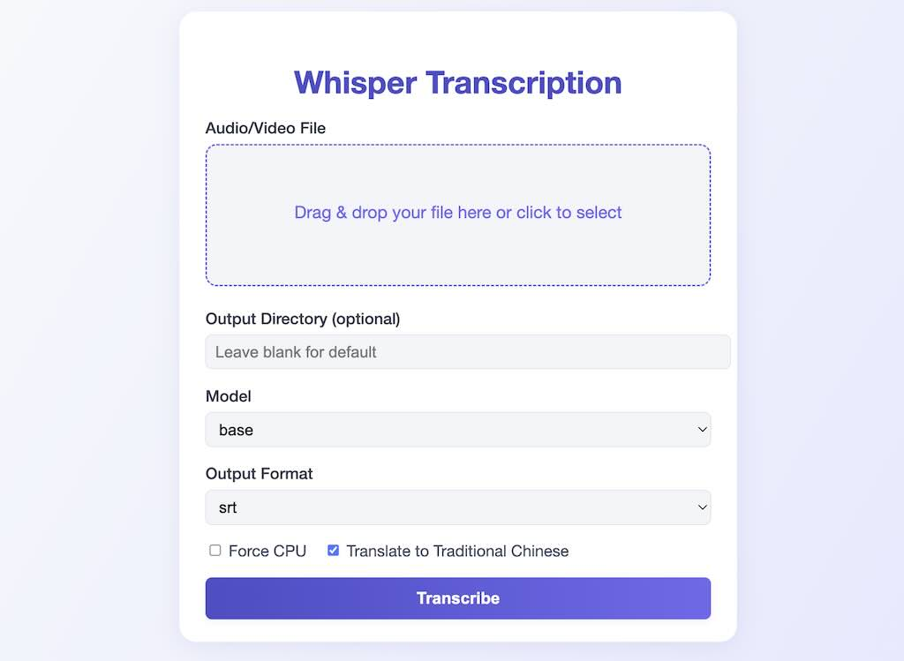
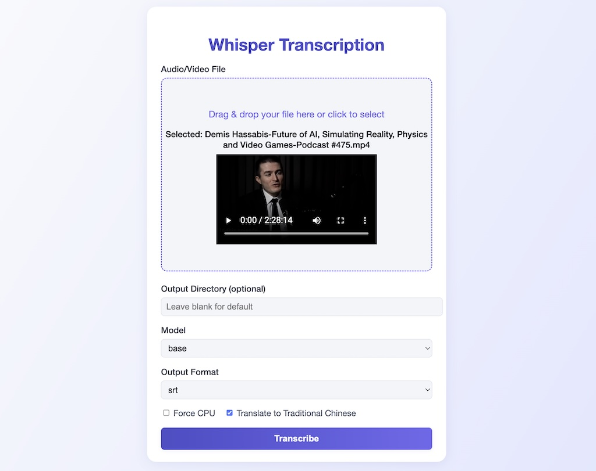
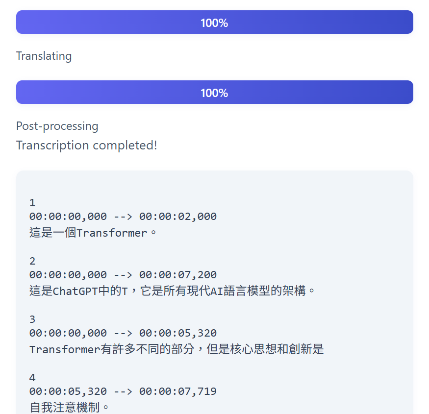

# My Whisper Project

This project provides a local, space-saving(For MacOS/Windows11), and customizable setup for Whisper speech recognition models. It includes a web interface for easy transcription, local model storage, and support for translation and "Custom dictionaries".

自動生成繁體中文影片字幕
---


## Quick Start: Web App

### 1. Install Python & Dependencies

**Recommended:** Python 3.12

Create a virtual environment and install dependencies:

```MacOS bash
python3.12 -m venv .venv
source .venv/bin/activate
pip install -r requirements.txt
```
```Windows PowerShell
python3.12 -m venv .venv
.venv/Scripts/activate
pip install -r requirements.txt
```

### 2. Download Whisper Models

Download at least one Whisper model to the `models/` directory:

```bash
python whisper_models.py download base
# Or use the interactive downloader:
python whisper_models.py list
```

### 3. Configure Model Directory

Set the environment variable so Whisper uses your local models directory:

```bash
export WHISPER_CACHE_DIR="$(pwd)/models"
```

### 4. Run the Web App

Start the Flask web server:

```bash
python3 whisper_web/app.py
```

Open your browser and go to: [http://127.0.0.1:5001](http://127.0.0.1:5001)

---

## Features

- Upload audio/video files for transcription
- Choose Whisper model, output format, and translation to Traditional Chinese
- Progress bar for long-running jobs
- Robust background processing (threaded, no Redis/Celery required)
- Custom dictionary for translation overrides (`custom_dict.txt`)
- Auto-fix for extra spaces between Chinese words in translation output (SRT/TXT will not have unwanted spaces)

---


---

## Advanced: Model Management

List, download, or remove models:

```bash
python whisper_models.py status
python whisper_models.py list
python whisper_models.py download base
python whisper_models.py remove tiny
```

---

## Project Structure

```
myWhisper/
├── .venv/                 # Python virtual environment
├── models/                # Whisper models storage
├── whisper_models.py      # Model management utility
├── custom_dict.txt        # Custom translation dictionary
├── README.md              # This file
└── whisper_web/           # Web interface
    ├── app.py             # Flask web app
    ├── celery_worker.py   # Threaded background worker
    ├── templates/         # HTML templates
    ├── static/            # CSS/JS/static files
    └── uploads/           # Uploaded files
```

---

## Configuration

- **Model Directory:** Set `WHISPER_CACHE_DIR` to use your local `models/` folder.
- **Custom Dictionary:** Edit `custom_dict.txt` to override translations (format: `source=target`).
- **Virtual Environment:** Use `.venv` for Python dependencies.

---

## Usage Tips

- Start with the `tiny` or `base` model for quick tests.
- Use the web interface for easy uploads and progress tracking.
- Edit `custom_dict.txt` to fine-tune translation results.
- All output files (SRT, TXT) are saved with the same base name as your input file.
- Any extra spaces between Chinese words (e.g. `算法的 實際`) caused by translation will be automatically removed in the final output.

---

## Troubleshooting

- If you see errors about missing models, run `python whisper_models.py download base`.
- If you see device errors, force CPU by selecting "Force CPU" in the web UI.
- For best results, keep your models and virtual environment on a fast drive.
- If you see extra spaces between Chinese words in SRT/TXT, the system will now auto-fix them before saving output.

---

## Credits

- OpenAI Whisper
- Flask
- deep-translator
- All contributors

## Setup

The project is already configured with:
- ✅ Python 3.12 virtual environment (for NumPy compatibility)
- ✅ OpenAI Whisper installed
- ✅ Custom models directory: `./myWhisper/models`
- ✅ Existing `tiny` model copied from system cache

## Usage

### 1. Activate Environment

```bash
source setup_env.sh
```

This will:
- Activate the Python 3.12 virtual environment
- Set `WHISPER_CACHE_DIR` to use the project's models directory
- Display available commands

### 2. Manage Models

#### Individual Model Management
```bash
# Check current status
python whisper_models.py status

# List all available models
python whisper_models.py list

# Download a specific model (e.g., base model)
python whisper_models.py download base

# Remove a model to free space
python whisper_models.py remove tiny
```

#### Download All Models
```bash
# Interactive downloader (recommended)
python download_all_models.py

# Download all models (~8.5 GB)
python download_all_models.py --all

# Download recommended set (tiny, base, small, turbo ~ 1.2 GB)
python download_all_models.py --recommended

# Download all except large models (~3.3 GB)
python download_all_models.py --all --exclude-large

# Download all except English-only models
python download_all_models.py --all --exclude-english-only
```

### 3. Use Whisper

#### Easy Transcription Script (Recommended)
```bash
# Interactive mode - script will ask for file path and model
./transcribe.sh

# Direct usage with file path (default output is .srt subtitle file)
./transcribe.sh path/to/audio.wav

# Specify model and output options
./transcribe.sh path/to/audio.mp3 --model base --output transcripts
./transcribe.sh path/to/video.mp4 --model large-v3 --format all
```

**Features:**
- Automatically deactivates conda environment
- Activates Python virtual environment
- Supports all audio/video formats (wav, mp3, mp4, avi, mov, etc.)
- Interactive model selection
- **Default output is .srt subtitle file** (can be changed with --format)
- Multiple output formats: txt, json, srt, all
- Progress feedback and error handling
- **All PyTorch and backend warnings are suppressed for clean output**
- Device info (CPU, MPS, CUDA) is shown at start

#### Standard Command Line Usage
```bash
# After sourcing setup_env.sh
whisper audio_file.wav
whisper audio_file.mp3 --model base
whisper audio_file.wav --model base --output_dir transcripts
```

#### Python Usage
```python
import os
from pathlib import Path
import whisper

# Set up the custom models directory
os.environ['WHISPER_CACHE_DIR'] = './myWhisper/models'

# Load model (will use/download to custom directory)
model = whisper.load_model("tiny")

# Transcribe audio
result = model.transcribe("audio_file.wav")
print(result["text"])
```

## Available Models

| Model | Size | Description |
|-------|------|-------------|
| tiny.en | ~39 MB | English-only, fastest |
| tiny | ~39 MB | Multilingual, fastest |
| base.en | ~74 MB | English-only, good balance |
| base | ~74 MB | Multilingual, good balance |
| small.en | ~244 MB | English-only, better accuracy |
| small | ~244 MB | Multilingual, better accuracy |
| medium.en | ~769 MB | English-only, high accuracy |
| medium | ~769 MB | Multilingual, high accuracy |
| large-v3 | ~1550 MB | Multilingual, highest accuracy |
| turbo | ~809 MB | Multilingual, fast + accurate (latest) |

## Benefits of This Setup

1. **Space Saving**: Models are stored on your external drive instead of filling up your Mac's startup drive
2. **Version Control**: You can version control your Whisper setup and models
3. **Isolation**: Project-specific Python environment with compatible dependencies
4. **Easy Management**: Simple scripts to download/remove models as needed
5. **Portability**: Everything is contained in the project directory

## Current Status

- **Python Version**: 3.12.11 (for NumPy compatibility)
- **Models Directory**: `/Volumes/2TLexarNM610Pro/AI/myWhisper/models`
- **Downloaded Models**: 
  - ✅ tiny (72.1 MB)
  - ✅ base (138.5 MB)
  - ✅ small (461.2 MB)
  - ✅ large-v3-turbo (1543.0 MB)
  - ✅ large-v3 (2944.3 MB)
- **Total Disk Usage**: 5.04 GB

## Tips

**Default Output:**
- By default, all transcriptions are saved as `.srt` subtitle files next to your audio/video file.
- You can use `--format txt`, `--format json`, or `--format all` for other output formats.

**Clean Output:**
- All PyTorch backend registration and device warnings are suppressed for a clean experience.
- You will only see progress, device info, and results.

**Tips:**
- Start with the `tiny` model for testing (already downloaded)
- Use `base` model for good balance of speed and accuracy
- Use `turbo` model for best balance of speed and accuracy
- Only download larger models if you need maximum accuracy
- The English-only models (.en) are faster if you only process English audio

# Whisper Web Transcription (with Celery Task Queue)

## Features
- Upload audio/video files for transcription
- Choose Whisper model, output format, and translation to Traditional Chinese
- Progress bar for long-running jobs
- Robust background processing using Celery + Redis
